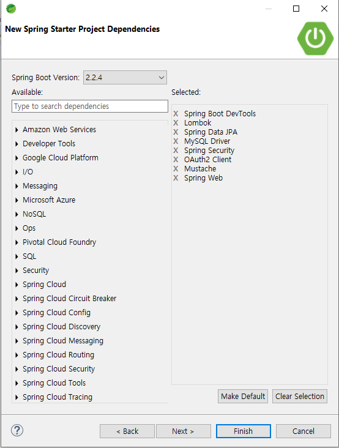

# Springboot-AWS-Alone-Service

## 세팅
- 의존성 추가
- STS Setting 완료
- Spring-Security, OAuth2-Client 주석 처리 (나중에 할 것이니까)
- MySQL, JPA 주석 처리 (나중에 할 것이니까)
- BuildPath에 JUnit5 등록

## .gitignore 가 작동안하면
(https://jojoldu.tistory.com/307)
